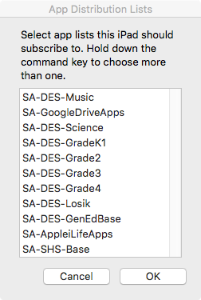

casfigurator
======
*Need to talk it out? Head to the [#ac2-automation](https://macadmins.slack.com/archives/C7PEE7HTK) channel on the [MacAdmins Slack](macadmins.slack.com)*

*Improved, wire-assisted, but over-the-air iOS “imaging” with Configurator 2's automation tools and Casper. (Essentially: trying to emulate Munki+DeployStudio for iPads.)*

*(Casfigurator prompting a user to select the app lists to apply to connected iOS devices)*

###**_Now on version 0.1!_**
You can find it on the [releases page](https://github.com/bumbletech/casfigurator/releases)

[Here's a video overview and demo of version v0.1](https://youtu.be/taqDR3x-GC4)

####Introduction
The goal of Casfigurator is to give field technicians, "accidental-technicians" (secretaries, teachers, interns) and other laymen a tool to setup cart-based/non-user-assigned iOS devices with a menu of pre-determined app distribution groups—all without having to manually create groups, or update app scopes on the JSS. Casfigurator is a collection of AppleScripts that connects Apple Configurator 2 (and its very important automation tools) with the Casper JSS API. This allows guided iPad setup and the ability to add App Distribution manifests in an easy way that doesn't use the Terminal or CSVs.

Essentially: My way of trying to emulate Munki+DeployStudio for iPads.

These scripts can be run on their own after initial iPad setup, or as part of an Automator workflow to allow for a single-launch guided setup.

[View the orignal proof-of-concept video and demo here](https://www.youtube.com/watch?v=g98iwQDwUb0)

####Requirements
1. Minumum macOS: 10.11 - El Capitan (tested through 10.12.4)
2. Configurator 2 (tested with v2.2.1-v2.4)
3. Configurator Automation Tools Installed
4. JAMF’s Casper Suite (tested with 9.91-v9.99b)
5. A user with Mobile Device write access in the API
6. Probably a test JSS. Definitly a test JSS.

A few words of caution
-----

This has been tested on a fresh JSS as well as my test and production JSSes. While I'm confident you will not break anything that already exists, your experince may vary. The script still makes some assumptions (like your JSS being available, your devices being supervised, etc). So far, I've handled a few major errors—some will just pass the error on to you and quit. [Please, report any bugs.](https://github.com/bumbletech/casfigurator/issues)

Setup
-----
###On the JSS

The basic goal is to try to emulate Munki-type manifests in the JSS. This is achieved by an extension attribute called “App Distribution Group” and series of smart groups.

Version 0.1 comes with "casfigurator_jss_setup.sh"—a bash script that will add the proper extension attributes and help you create smart groups with the proper criteria. All you need is your JSS URL and a JSS account with write access to the API.

Otherwise, you can create your extension attribute with the following information:

1. Display Name: "App Distribution Group"
2. Description: Used to facilitate app assignment with Casfigurator
3. Data Type: String
4. Inventory Display: General
5. Input Type: Text Field

The setup script will also help you create your App Distribution Smart groups, but you can create them manually as well:

1. Display Name: "App Distribution Group - (criteria/name)"
2. Criteria: "App Distribution Group" is LIKE "(criteria-string)" <- This criteria string can't contain spaces

You will then need to scope apps to your smart groups on the JSS. For now, you'll have to do that the old fashined way.

###On the Mac
Install Configurator Automation Tools:

1. Launch Configurator
2. In the drop down menus - “Apple Configurator 2 > Install Migration Tools” (check out http://krypted.com/iphone/install-the-command-line-tools-using-apple-configurator-2/ for a better guide)

If you’re using DEP, you’ll want to make sure that Configurator 2 and your JSS are using the same Supervision Identity. See Supervision Identities section in this JAMF guide: http://resources.jamfsoftware.com/documents/technical-papers/Deploying-iOS-Devices-with-the-Casper-Suite-and-Apple-Configurator-2-v9.82-or-Later.pdf

###The Client-side AppleScripts

Casfigurator_iPad_Setup_Name_and_AppGroups.app
Casfigurator_Unplugged-Change_AppGroups

Version v0.1 reads your extension attribute for "App Distribution Groups" and smart groups with names  like "App Distribution Group" from the JSS API. You will not need to edit this script.

All you will need is your JSS URL, a JSS account with write access to the API and a copy of Configurator 2 with the proper supervision authoriy over the connected iPads.

There is also an "Unplugged" AppleScript that will allow you to change App Distribution Group criteria written to your device records without devices being connected to Configurator 2. This uses the JSS API's match function to find devices by their basename and then overwrite the "App Distribution Group" field on each device record with your newly entered selections.

